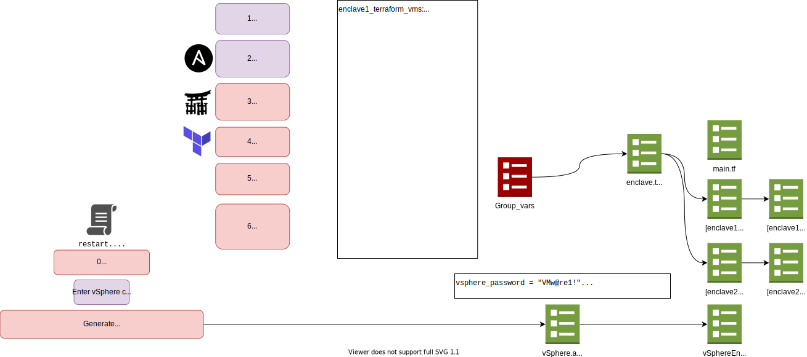

# Environment 

## Instructor Experience

# Design

## Terraform

## Day 0 Deployment
- **Manually** provision `Control` VM
- **Manually** git clone `https://github.com/uwardlaw/vater` into `~`
- **Manually** run ` ~/vater/control-services/bin/setup.sh`
- `setup.sh` will create a RSA key pair if one does not exist and print the public key to the terminal
- **Manually** copy the public RSA key
- **Manually** input public RSA key into `uwardlaw/rous` as a deploy key 
- `setup.sh` will pull `uwardlaw/rous` locally
- `setup.sh` will execute `pythohn3 setupGitea.py`
- `setupGitea.py` will locally import `uwardlaw/rous` into `config/rous`

(Developed in Nano)
