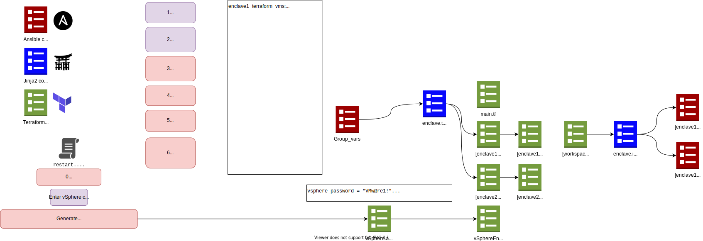

Getting Started with Terraform
--------------------------------
Terraform is an infrastructure as code tool that allows the user to define virtual resources in human-readable configuration files that can be used to track infrastructure, automate changes, and standardized configurations. By implementing this resource in VATER, it will allow a consistent workflow and aid in the management of all the infrastructure.

Terraform creates and manages resources through their application programming interfaces. There are three core stages in the Terraform workflow:

- **Write**: The developer can define resources. In reference to VATER, the developer can create a configuration to deploy an application on virtual machines in the network. 
- **Plan**: Terraform creates an execution plan describing the infrastructure it will create, update, or destroy based on the current infrastructure configuration.
- **Apply**: Terraform provisions your infrastructure and updates the state file.

More Information: 

- `Terraform <https://www.terraform.io/intro>`__

How is Terraform Designed within VATER?
~~~~~~~~~~~~~~~~~~~~~~~~~~~~~~~~~~~~~~

Debugging
~~~~~~~~~

Lock State Errors
^^^^^^^^^^^^^^^^^

Terraform uses state locks to prevent multiple users from modifying the
same terraform resources at once. If a task terminates prematurely or is
completed unsuccessfully, terraform may not release the state lock,
which causes errors. To forcibly kill the terraform processes holding
state locks run these commands

::

   ps -ef | fgrep terraform | awk '{print $2}' | tee /tmp/pids
   sudo kill $(cat /tmp/pids)

or ``sudo killall terraform``

Hanging Tasks
^^^^^^^^^^^^^

If semaphore is hanging and not showing helpful errors or warnings,
`plan <https://www.terraform.io/cli/commands/plan>`__ and
`apply <https://www.terraform.io/cli/commands/apply>`__ are two helpful
Terraform CLI commands. ``terraform plan -out fileName`` and
``terraform apply "fileName"`` allow for troubleshooting terraform
specifically and in a more isolated manner. The ``plan`` command will
ask for inputs to define variables - these can be found in
``groupvars/all/folderOfThingToDebug`` along with the global var files

Note: vm path should be ``class/student`` aka the prev 2 answers
combined give you the final answer
